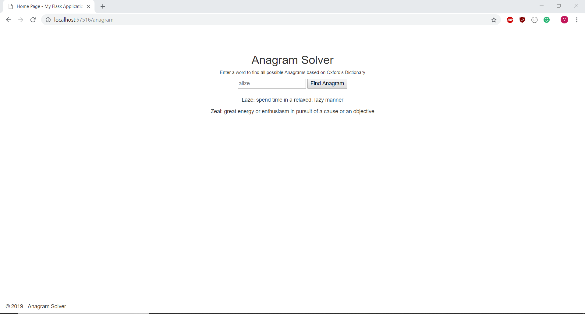

# Anagram Finder

## Intro

This is a simple web application built using the Python Flask framework used to find possible anagrams of a given string along with its definition

## APIs

[Anagramica](http://anagramica.com/api)
[Oxford](https://developer.oxforddictionaries.com/)

## Framework

This application is built with Visual Studio 2017 and uses the Flask Framework

## Limitations

This application is unable to return anagrams for longer strings and is thus limited to a lower character count. Future iterations will look for a more efficiency anagram solver 

## Output

